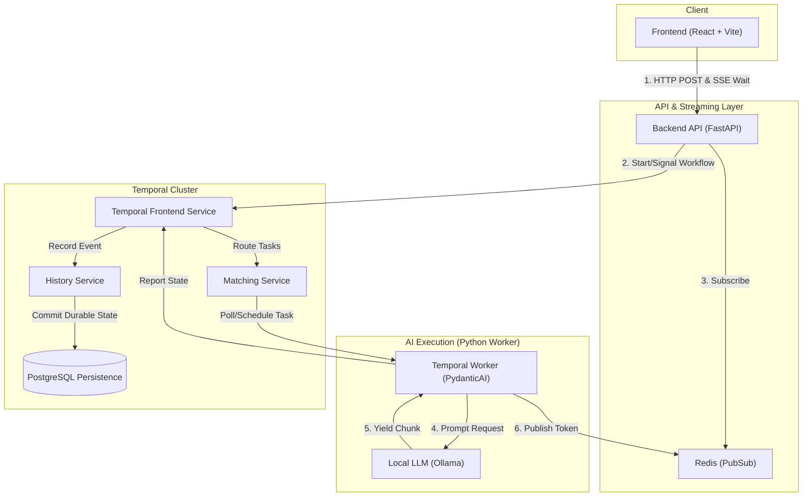
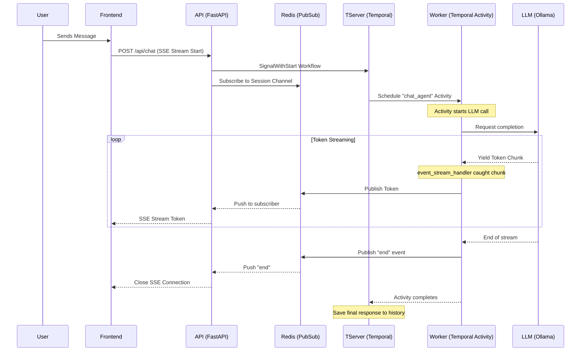

# Streaming AI Chatbot with PydanticAI & Temporal

A simple AI chatbot I threw together to test out PydanticAI real-time streaming while using Temporal to keep track of the conversation history reliably without a database.

## 🚀 Quick Start

1. **Start the backend and frontend infrastructure:**
   ```bash
   docker-compose up -d
   ```
   > [!TIP]
   > If you have an NVIDIA GPU and the NVIDIA Container Toolkit installed, run `docker-compose --profile gpu up -d` to enable hardware acceleration for the local LLM!

2. Navigate to `http://localhost:5173` to use the chatbot.
3. Visit the **Temporal UI** at `http://localhost:8080` to inspect the underlying workflows and history.

---

## 🏗️ System Design

This diagram represents the physical infrastructure spun up by Docker Compose and how the Temporal internal components interact with our application logic:



---

## 🔄 Request Lifecycle


The core challenge I set out to solve was cleanly separating the **durable execution** of the workflow from the **ephemeral streaming** of tokens. Because the Temporal Activity can run on any worker in the network, we need a "shared memory" bridge to get those tokens back to the specific API server the user is connected to.

- **Frontend (React/Vite)**: Manages distinct conversation sessions and consumes Server-Sent Events (SSE) via `@microsoft/fetch-event-source`.
- **Backend (FastAPI)**: Subscribes to Redis and parks the request in an `async for` loop, waiting for tokens to arrive.
- **Workflow Engine (Temporal)**: Uses `Signal-With-Start` to maintain a long-lived, stateful "brain" per conversation ID.
- **LLM Orchestration (PydanticAI `TemporalAgent`)**: Offloads LLM logic to a **Temporal Activity**. This ensures that even if the network or the LLM call fails, Temporal handles the retries and state management.
- **Streaming Bridge (Redis PubSub)**: This is the critical piece. The `event_stream_handler` (running on a **Temporal Worker**) shouts tokens into Redis. The **API Server** (listening to Redis) hears them and forwards them to the User. This allows the system to scale horizontally across multiple API servers and Worker pods.

---

## ⚖️ Tradeoffs & Design Decisions

Handling streaming across Temporal's execution model requires careful compromises. Here is what was chosen, why, and what was intentionally left out:

### 1. State Management: Temporal vs. External Database
**My Decision**: I chose to store the entire chat history purely in the Temporal Workflow's state and retrieve it via Temporal Queries.
**Why I did this**: For an MVP, I found that Temporal is uniquely positioned to handle both the execution logic and the state itself. This saved me from the immediate complexity of dual-writing to an external database (like Postgres) and trying to keep that database perfectly in sync with the workflow.
**Tradeoff**: I know Temporal is an orchestration engine, not a primary database. High-frequency UI queries against Temporal state can eventually degrade cluster performance. 
**What I’d do with more time**: I would implement the ability to sync between the Temporal state messages and the external database.

### 2. Payload Sizes and Blob Limits
**My Decision**: I pass raw `ModelMessage` objects (from PydanticAI) directly into Temporal signals and store them in the workflow state.
**Tradeoff**: Temporal has strict payload limits (defaults to 2MB, hard limit 50MB). Generative AI conversations with massive contexts will eventually hit this limit and crash the workflow.
**What I’d do with more time**: I would implement a custom Data Converter with Payload Offloading to S3. The workflow would only store small pointers, while the heavy text or image payloads would reside safely in blob storage.

### 3. Streaming Intermediary: Redis PubSub
**My Decision**: Halfway through development, I upgraded from an in-memory Python `asyncio.Queue` to Redis PubSub for handing off tokens between the Temporal Activity and the FastAPI SSE route.
**Why I did this**: An in-memory queue fundamentally pinned my SSE connection to the specific worker pod executing the LLM activity. Integrating Redis allows for horizontal scaling, meaning any API pod can serve the SSE stream to the user regardless of which worker pod handles the actual LLM generation activity.

### 4. Auth & User Management
**My Decision**: I explicitly omitted this.
**Why I did this**: I talked to Kurien regarding some of the needs and we decided to keep it simple for now. 

### 5. Tool Calling & Agentic Capabilities
**My Decision**: I left this out of the MVP to focus purely on the streaming and orchestration reliability.
**What I’d do with more time**: I would absolutely implement PydanticAI tools and dependencies so my agent could fetch live external data natively during the streaming flow.

### 6. Multiple LLM Provider Support
**My Decision**: I hardcoded the model to use a local Ollama instance (using the OpenAI compatible interface). 
**Why I did this**: I hadn't built an app utilizing local LLMs before, so I really wanted to use Ollama for the first time in an actual project context.
**What I’d do with more time**: I'd introduce a frontend selector and backend interface to seamlessly swap between various providers (OpenAI, Anthropic, Gemini) using PydanticAI's built-in multi-model routing capabilities.

### 7. Multimodality (Image Input)
**My Decision**: Omitted to keep the state management strictly text-based and simple for now.
**What I’d do with more time**: Update the chat payloads and frontend UI so users can drop images straight into the chat for vision model analysis.

### 8. Retrieval-Augmented Generation (RAG)
**My Decision**: Omitted from the MVP to focus on the core chat orchestration.
**What I’d do with more time**: I would build an ingestion pipeline into a vector store and provide the Pydantic agent with a tool to fetch required context dynamically before generating a response. Getting the bot to cite proprietary documents is the logical next step!

---

## 🛠️ Code Quality & Error Handling

- **Type Safety**: Strictly typed models using Pydantic. I chose to rely entirely on PydanticAI's native `ModelMessage` type across the whole stack to prevent custom-mapping bugs and save myself translation headaches.
- **Error Recovery**:  If a worker crashes mid-stream, Temporal just retries the activity. The UI handles SSE reconnects and reconstructs the stream without duplicating previous UI cards.
- **Log Refinement**: I added granular, structured logging so I could surface exactly when my Temporal signals are received, when my activities start, and when my SSE streams completely finish. It was a lifesaver for debugging.

---

## 📁 Repository Structure

- `/backend`: Contains my FastAPI server, Temporal definitions (workflows/activities), and dependencies.
- `/frontend`: My React + Shadcn UI user interface.
- `/scripts`: The shell scripts I use in my Docker Compose setup to smoothly initialize the Temporal cluster (like waiting for Postgres to start, and registering the default Temporal namespace).
- `/dynamicconfig`: Configuration settings for the Temporal cluster (used by Docker to define Temporal's dynamic behavior).
- `plan.md`: The chronological journal and build plan reflecting the checkpoints of my progress building this.
- `docker-compose.yml`: Infrastructure configuration standing up Redis, Temporal, and Ollama all together.
