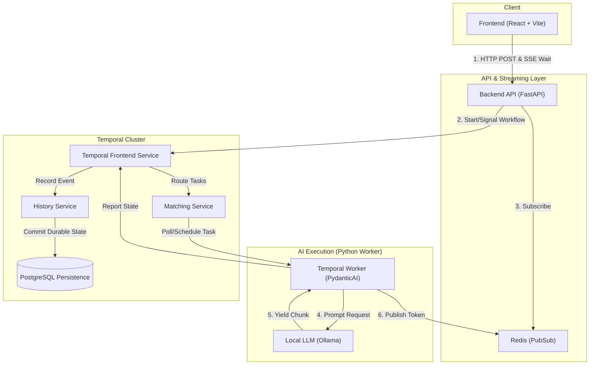

# Streaming AI Chatbot with PydanticAI & Temporal

Hey there! This is a full-stack AI chatbot I built to tackle a really interesting engineering challenge: orchestrating LLM interactions using PydanticAI while relying on Temporal for durable execution, long-lived conversation state, and resilience. I wanted to see if I could combine real-time token-by-token streaming with the strict deterministic requirements of a workflow engine.

## 🚀 Quick Start

1. **Start the backend and frontend infrastructure:**
   ```bash
   docker-compose up -d
   ```
   > [!TIP]
   > If you have an NVIDIA GPU and the NVIDIA Container Toolkit installed, run `docker-compose --profile gpu up -d` to enable hardware acceleration for the local LLM!

2. Navigate to `http://localhost:5173` to use the chatbot.

---

## 🏗️ System Design

This diagram represents the physical infrastructure spun up by Docker Compose and how the Temporal internal components interact with our application logic:



---

## 🔄 Request Lifecycle

sequenceDiagram
    participant User
    participant Frontend as React
    participant API as FastAPI
    participant Redis as Redis PubSub
    participant Temporal as Temporal Worker
    participant LLM as Ollama / PydanticAI

    User->>Frontend: Sends Message
    Frontend->>API: POST /api/chat (SSE Stream Start)
    API->>Temporal: SignalWithStart Workflow (chat_workflow)
    API->>Redis: Subscribe to Session Channel
    
    Temporal-->>Temporal: Append message to history
    Temporal->>LLM: temporal_agent.run() (Auto-spawns Activities)
    
    loop event_stream_handler execution
        LLM-->>LLM: Yield Event/Token
        LLM->>Redis: Publish Token to Session Channel
        Redis-->>API: Receive Token
        API-->>Frontend: SSE Stream Token
    end
    
    LLM-->>Temporal: Stream finishes, returns AgentRunResult
    Temporal->>Temporal: Save final complete response to state
    API-->>Frontend: SSE Stream End
```

The core challenge I set out to solve was cleanly separating the **durable execution** of the workflow from the **ephemeral streaming** of HTTP tokens. Temporal's deterministic replay constraints usually clash with real-time UI updates, so here's how I designed the system:

- **Frontend (React/Vite)**: I built this to manage multiple distinct conversation sessions. It uses `@microsoft/fetch-event-source` to cleanly consume Server-Sent Events (SSE).
- **Backend (FastAPI)**: I exposed a few clear REST endpoints for history retrieval and SSE for streaming to keep the API surface incredibly small but functional.
- **Workflow Engine (Temporal)**: 
  - I used the `Signal-With-Start` pattern to maintain a **long-lived workflow** per conversation session. 
  - I decided to make the workflow's durable state the single source of truth for all conversation history. It feels clean and leverages Temporal's strengths.
- **LLM Orchestration (PydanticAI `TemporalAgent`)**: I used PydanticAI's native `TemporalAgent` wrapper. Instead of writing custom Temporal Activities manually, I simply call `temporal_agent.run()` directly inside my Workflow. The `TemporalAgent`offloads all the network I/O operations (like model generation and tool calling) into securely orchestrated Temporal Activities.
- **Streaming Hand-off (Redis PubSub)**: PydanticAI's `TemporalAgent` allows us to define an `event_stream_handler`. As my agent yields events, this handler (which `TemporalAgent` automatically runs inside an Activity) pushes the tokens to a Redis PubSub channel. My FastAPI SSE route subscribes to this channel and streams the tokens to the client.

---

## ⚖️ Tradeoffs & Design Decisions

Handling streaming across Temporal's execution model requires careful compromises. Here is what was chosen, why, and what was intentionally left out:

### 1. State Management: Temporal vs. External Database
**My Decision**: I chose to store the entire chat history purely in the Temporal Workflow's state and retrieve it via Temporal Queries.
**Why I did this**: For an MVP, I found that Temporal is uniquely positioned to handle both the execution logic and the state itself. This saved me from the immediate complexity of dual-writing to an external database (like Postgres) and trying to keep that database perfectly in sync with the workflow.
**Tradeoff**: I know Temporal is an orchestration engine, not a primary database. High-frequency UI queries against Temporal state can eventually degrade cluster performance. 
**What I’d do with more time**: I would implement the ability to sync between the Temporal state messages and the external database.

### 2. Payload Sizes and Blob Limits
**My Decision**: I pass raw `ModelMessage` objects (from PydanticAI) directly into Temporal signals and store them in the workflow state.
**Tradeoff**: Temporal has strict payload limits (defaults to 2MB, hard limit 50MB). Generative AI conversations with massive contexts will eventually hit this limit and crash the workflow.
**What I’d do with more time**: I would implement a custom Data Converter with Payload Offloading to S3. The workflow would only store small pointers, while the heavy text or image payloads would reside safely in blob storage.

### 3. Streaming Intermediary: Redis PubSub
**My Decision**: Halfway through development, I upgraded from an in-memory Python `asyncio.Queue` to Redis PubSub for handing off tokens between the Temporal Activity and the FastAPI SSE route.
**Why I did this**: An in-memory queue fundamentally pinned my SSE connection to the specific worker pod executing the LLM activity. Integrating Redis allows for horizontal scaling, meaning any API pod can serve the SSE stream to the user regardless of which worker pod handles the actual LLM generation activity.

### 4. Auth & User Management
**My Decision**: I explicitly omitted this.
**Why I did this**: I talked to Kurien regarding some of the needs and we decided to keep it simple for now. 

### 5. Tool Calling & Agentic Capabilities
**My Decision**: I left this out of the MVP to focus purely on the streaming and orchestration reliability.
**What I’d do with more time**: I would absolutely implement PydanticAI tools and dependencies so my agent could fetch live external data natively during the streaming flow.

### 6. Multiple LLM Provider Support
**My Decision**: I hardcoded the model to use a local Ollama instance (using the OpenAI compatible interface). 
**Why I did this**: I hadn't built an app utilizing local LLMs before, so I really wanted to use Ollama for the first time in an actual project context.
**What I’d do with more time**: I'd introduce a frontend selector and backend interface to seamlessly swap between various providers (OpenAI, Anthropic, Gemini) using PydanticAI's built-in multi-model routing capabilities.

### 7. Multimodality (Image Input)
**My Decision**: Omitted to keep the state management strictly text-based and simple for now.
**What I’d do with more time**: Update the chat payloads and frontend UI so users can drop images straight into the chat for vision model analysis.

### 8. Retrieval-Augmented Generation (RAG)
**My Decision**: Omitted from the MVP to focus on the core chat orchestration.
**What I’d do with more time**: I would build an ingestion pipeline into a vector store and provide the Pydantic agent with a tool to fetch required context dynamically before generating a response. Getting the bot to cite proprietary documents is the logical next step!

---

## 🛠️ Code Quality & Error Handling

- **Type Safety**: Strictly typed models using Pydantic. I chose to rely entirely on PydanticAI's native `ModelMessage` type across the whole stack to prevent custom-mapping bugs and save myself translation headaches.
- **Error Recovery**:  If a worker crashes mid-stream, Temporal just retries the activity. The UI handles SSE reconnects and reconstructs the stream without duplicating previous UI cards.
- **Log Refinement**: I added granular, structured logging so I could surface exactly when my Temporal signals are received, when my activities start, and when my SSE streams completely finish. It was a lifesaver for debugging.

---

## 📁 Repository Structure

- `/backend`: Contains my FastAPI server, Temporal definitions (workflows/activities), and dependencies.
- `/frontend`: My React + Shadcn UI user interface.
- `/scripts`: The shell scripts I use in my Docker Compose setup to smoothly initialize the Temporal cluster (like waiting for Postgres to start, and registering the default Temporal namespace).
- `/dynamicconfig`: Configuration settings for the Temporal cluster (used by Docker to define Temporal's dynamic behavior).
- `plan.md`: The chronological journal and build plan reflecting the checkpoints of my progress building this.
- `docker-compose.yml`: Infrastructure configuration standing up Redis, Temporal, and Ollama all together.
