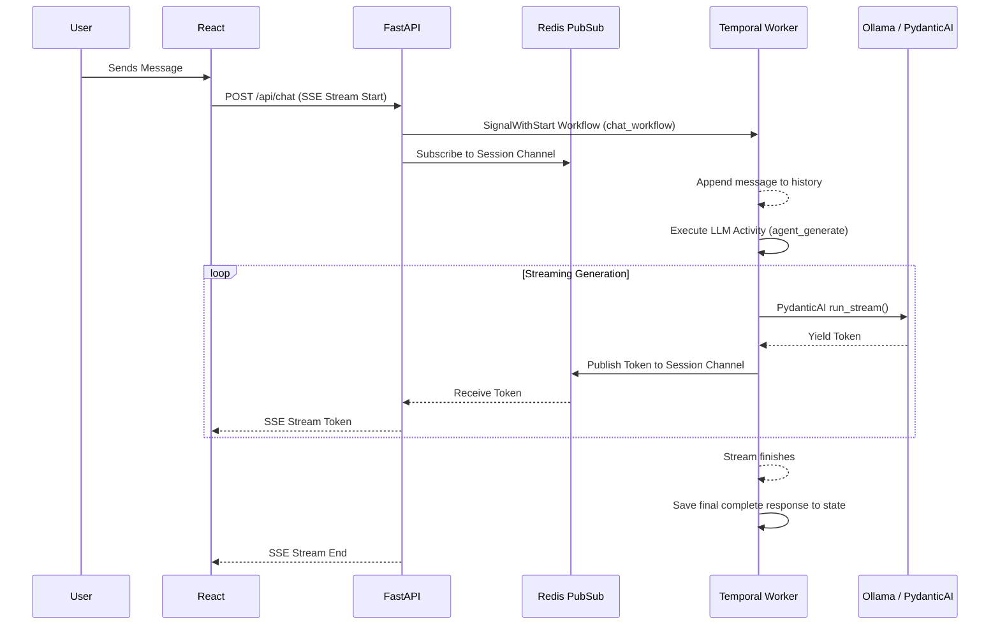

# Streaming AI Chatbot with PydanticAI & Temporal

A full-stack AI chatbot demonstrating token-by-token streaming alongside durable execution. This project orchestrates LLM interactions using PydanticAI while relying on Temporal for workflow execution, long-lived conversation state, and resilience.

## 🚀 Quick Start

1. **Start the backend infrastructure (Temporal, Redis, Ollama, API Backend):**
   ```bash
   docker-compose up -d
   ```
2. **Start the frontend (React + Vite):**
   ```bash
   cd frontend
   npm install
   npm run dev
   ```
3. Navigate to `http://localhost:5173` to use the chatbot.

---

## 🏗️ Architecture



The system is designed to cleanly separate the **durable execution** of the workflow from the **ephemeral streaming** of tokens, resolving the tension between Temporal's deterministic replay constraints and real-time UI updates.

- **Frontend (React/Vite)**: Manages multiple distinct conversation sessions. Uses `@microsoft/fetch-event-source` to consume Server-Sent Events (SSE).
- **Backend (FastAPI)**: Exposes REST endpoints for history retrieval and SSE for streaming.
- **Workflow Engine (Temporal)**: 
  - Maintains a **long-lived workflow** per conversation session using the `Signal-With-Start` pattern. 
  - The workflow's durable state is the single source of truth for the conversation history.
- **LLM Orchestration (PydanticAI)**: Runs inside a Temporal Activity. It interacts with the local LLM (Ollama) and yields structured tokens.
- **Streaming Hand-off (Redis PubSub)**: As the PydanticAI agent generates tokens inside the Temporal Activity, it pushes them to a Redis PubSub channel. The FastAPI SSE route subscribes to this channel and streams the tokens to the client. Once the stream completes, the Activity returns the final, aggregated response back to the Temporal workflow for durable storage.

---

## ⚖️ Tradeoffs & Design Decisions

Handling streaming across Temporal's execution model requires careful compromises. Here is what was chosen, why, and what was intentionally left out:

### 1. State Management: Temporal vs. External Database
**Decision**: The entire chat history is stored purely in the Temporal Workflow's state and retrieved via Temporal Queries.
**Why**: For an MVP, Temporal is uniquely positioned to handle both execution and state. This avoids the immediate complexity of dual-writing to an external database and keeping the database in sync with the workflow.
**Tradeoff**: Temporal is an orchestration engine, not a database. High-frequency UI queries against Temporal state can degrade cluster performance. 
**What I’d do with more time**: Implement an asynchronous drain (e.g., via Temporal's visibility or an out-of-band activity) to sync the conversation history to a transactional database (like PostgreSQL) optimized for UI reads.

### 2. Payload Sizes and Blob Limits
**Decision**: Raw `ModelMessage` objects (from PydanticAI) are passed directly into Temporal signals and stored in the workflow state.
**Tradeoff**: Temporal has strict payload limits (defaults to 2MB, hard limit 50MB). Generative AI conversations with massive contexts will eventually hit this limit and crash the workflow.
**What I’d do with more time**: Implement a custom Data Converter with Payload Offloading to S3. The workflow would only store pointers, while the heavy text/image payloads reside in blob storage.

### 3. Streaming Intermediary: Redis PubSub
**Decision**: We upgraded from an in-memory Python `asyncio.Queue` to Redis PubSub for handing off tokens between the Temporal Activity and the FastAPI SSE route.
**Why**: An in-memory queue pins the SSE connection to the specific worker pod executing the activity. Redis allows horizontal scaling, meaning any API pod can serve the SSE stream regardless of which worker pod handles the LLM activity.

### 4. Auth & User Management
**Decision**: Explicitly omitted.
**Why**: The core of this take-home assignment is orchestrating PydanticAI and Temporal streaming safely. Adding JWTs and users would bloat the codebase without demonstrating further competency in the core prompt tools.

### 5. Tool Calling & Agentic Capabilities
**Decision**: Omitted from MVP to focus purely on the streaming and orchestration reliability.
**What I’d do with more time**: Implement PydanticAI tools/deps so the agent can fetch external live data (like weather or database queries) during the streaming flow natively.

### 6. Multiple LLM Provider Support
**Decision**: Hardcoded to a local Ollama instance using the OpenAI interface mainly becuase I wanted to use Ollama for the first time in the context of building an app.
**What I’d do with more time**: Introduce a frontend selector and backend interface to seamlessly swap between various providers (OpenAI, Anthropic, Gemini) using PydanticAI's built-in multi-model capabilities.

### 7. Multimodality (Image Input)
**Decision**: Omitted to keep the state management strictly text-based.
**What I’d do with more time**: Update the chat payloads and frontend to accept image drops to the vision-capable LLM.

### 8. Retrieval-Augmented Generation (RAG)
**Decision**: Omitted from the MVP to focus on the core chat orchestration.
**What I’d do with more time**: Build an ingestion pipeline into a vector store and provide the Pydantic agent with a tool to fetch required context dynamically before generating a response.

---

## 🛠️ Code Quality & Error Handling

- **Type Safety**: Strictly typed models using Pydantic. We rely entirely on PydanticAI's native `ModelMessage` type across the stack to prevent custom-mapping bugs.
- **Error Recovery**: If a worker crashes mid-stream or the network drops, Temporal will retry the activity. The UI gracefully handles SSE reconnects and reconstructs the stream without duplicating previous UI cards.
- **Log Refinement**: Granular, structured logging was added to surface exactly when Temporal signals are received, activities start, and SSE streams conclude.

---

## 📁 Repository Structure

- `/backend`: FastAPI server, Temporal definitions (workflows/activities), and dependencies.
- `/frontend`: React + Shadcn UI application.
- `/scripts`: Shell scripts used by the Docker Compose setup to initialize the Temporal cluster (e.g., waiting for PostgreSQL to start, setting up default Temporal SQL schemas, and creating the default Temporal namespace).
- `/dynamicconfig`: Configuration configurations for the Temporal cluster (used by the docker-compose setup to define Temporal server's dynamic behavior).
- `plan.md`: The chronological build plan reflecting the checkpoints of progress.
- `docker-compose.yml`: Infrastructure configuration for Redis, Temporal, and Ollama.
