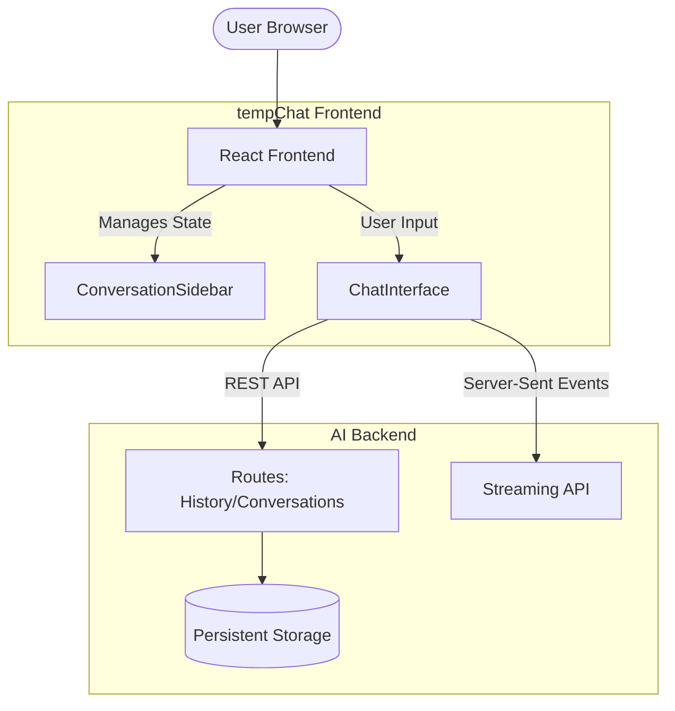

# tempChat - Frontend

The frontend for tempChat, built with React 19, Vite, and Tailwind CSS v4.

## Architecture



## SSE Implementation
The core chat streaming functionality is handled via Server-Sent Events (SSE). We use `@microsoft/fetch-event-source` within the `ChatArea.tsx` component to manage the stream state, handle retries, and parse consecutive AI message chunks. 

## Development

```bash
# Install dependencies
npm install

# Start development server
npm run dev

# Build for production
npm run build
```

> **Note**: An environment file (`.env`) is supported for overriding API endpoints (e.g., `VITE_API_URL`), but the application defaults to localhost configurations and will run out of the box without it.
